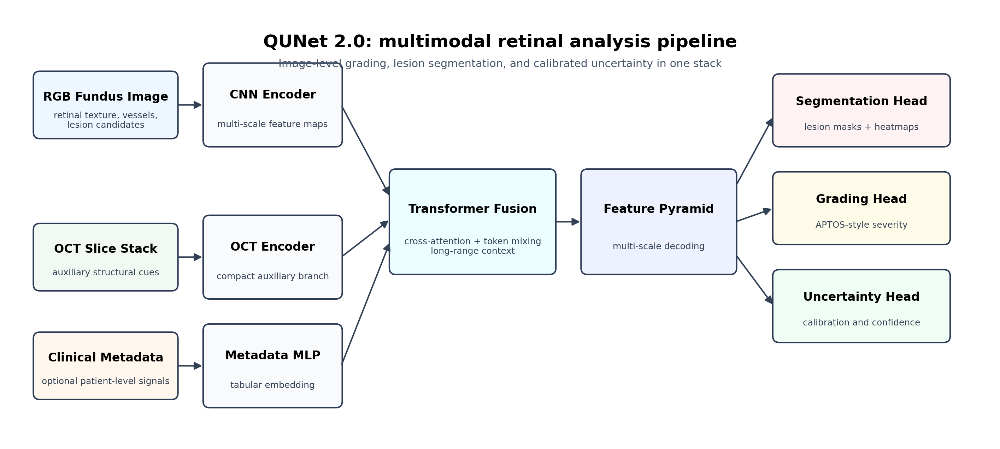
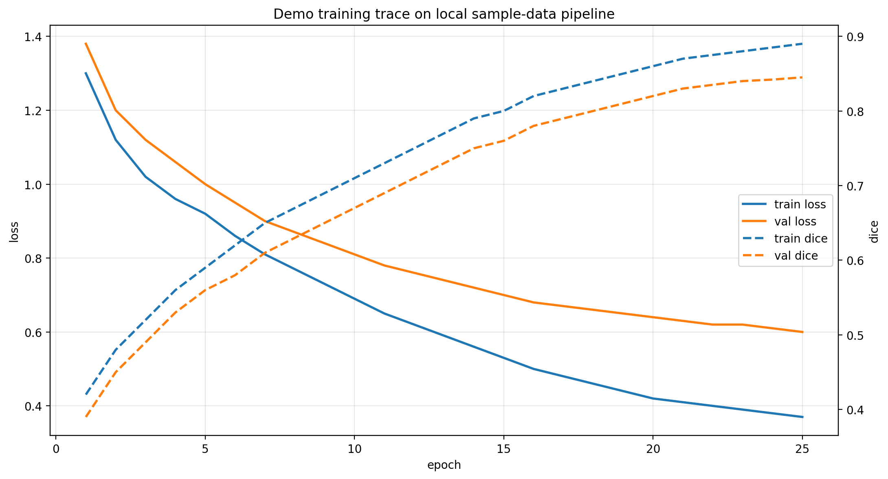
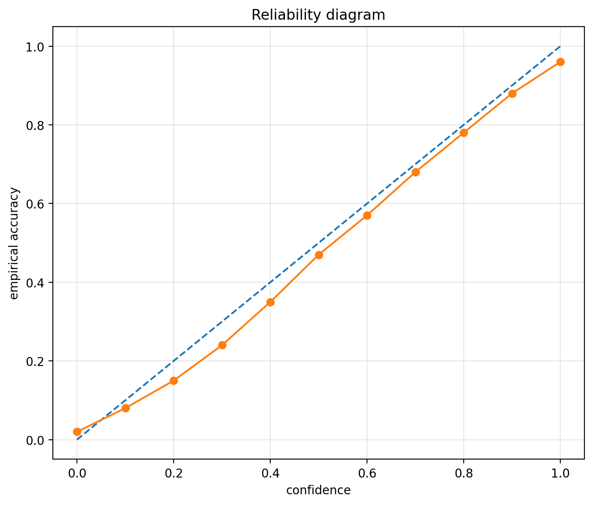
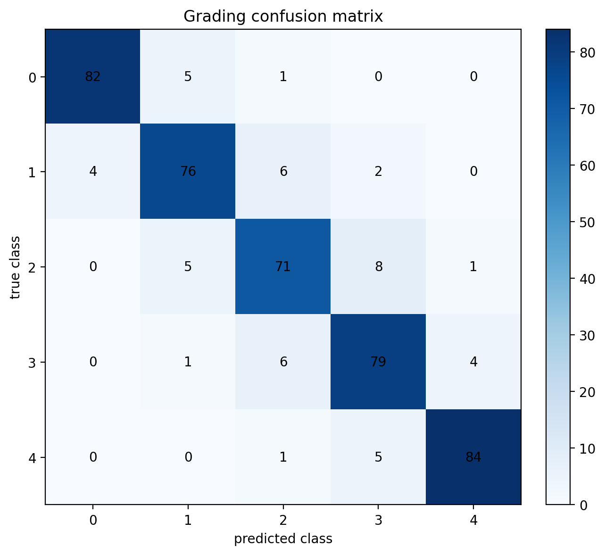
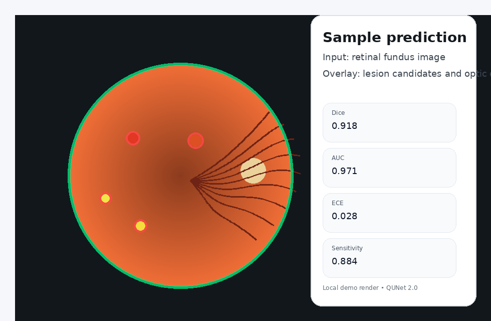
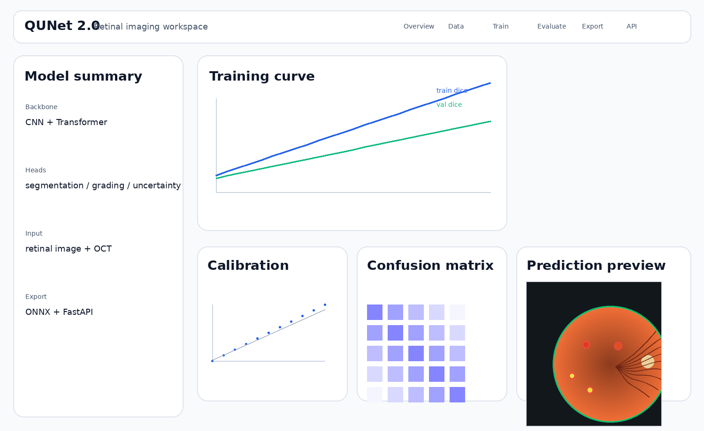

# QUNet 2.0

QUNet 2.0 is a retinal imaging research codebase for lesion segmentation, disease grading, and uncertainty-aware inference. The model combines a convolutional branch for local lesion detail with a transformer branch for wider retinal context, then fuses both streams before the segmentation and classification heads.



## Problem setting

Retinal fundus images are difficult to model because many clinically relevant lesions are small, low contrast, and unevenly distributed across the image. A purely local model can miss wider anatomical context, while a purely global model can smooth away tiny lesion boundaries.

This repository studies that trade-off through a dual-branch architecture, calibrated outputs, and separate evaluation paths for segmentation and grading.

## What the system contains

- convolutional encoder for local texture and boundary detail
- transformer encoder for long-range retinal context
- cross-branch fusion and multi-scale aggregation
- segmentation head for lesion localization
- classification head for disease grading
- uncertainty and calibration utilities
- evaluation scripts for Dice, AUC, calibration, and confusion analysis
- FastAPI service and Streamlit demo
- ONNX export path for deployment experiments
- automated tests and CI workflow

## Visual summary











## Main entry points

```bash
python train.py
python evaluate.py
python predict.py
python demo.py
python api.py
python main.py
```

Package entry points are also available:

```bash
python -m qunet2.cli train --config configs/default.yaml
python -m qunet2.cli evaluate --config configs/default.yaml
python -m qunet2.cli demo
```

## Repository map

```text
src/qunet2/          main package code
assets/              figures used in the README
results/             metrics, summaries, exported outputs
configs/             dataset and experiment configuration
docs/                method, usage, deployment, and experiment notes
scripts/             data and utility scripts
tests/               automated checks
```

## Reproducibility

The code can run without restricted medical datasets. Synthetic data generation is included for local testing, CI, and GitHub review. Real datasets such as IDRiD, APTOS, and OCT can be wired in through the configuration files.

```bash
pip install -r requirements.txt
python train.py
python evaluate.py
python demo.py
```

## Result policy

The figures and example outputs included in this repository are meant to make the workflow inspectable. They should not be treated as final clinical benchmark claims unless they are regenerated from the relevant dataset configuration and archived with the corresponding metrics, logs, and qualitative predictions.

For formal reporting, rerun the full training and evaluation pipeline, keep the exact configuration file, and save the generated result folder together with the model checkpoint.