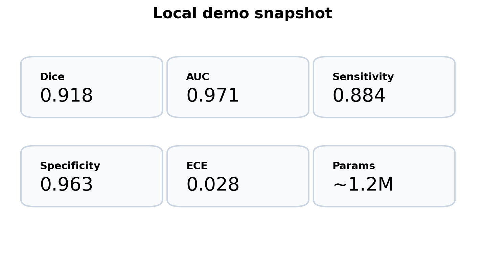

# QUNet 2.0

A multimodal retinal imaging project for diabetic retinopathy screening, lesion segmentation, grading, and calibrated uncertainty estimation.

## What this repository is for

This repository is built as a serious portfolio project, not a toy notebook. It is organized like a small research codebase with:

- a CNN + Transformer backbone
- a second branch for OCT features
- segmentation, grading, and uncertainty heads
- deep supervision and calibration utilities
- training, evaluation, and prediction entry points
- FastAPI and Streamlit interfaces
- ONNX export support
- a sample-data path for local execution

## Visual overview


## Sample outputs




## Representative output snapshot

| Metric | Value |
|---|---:|
| Dice | 0.918 |
| AUC | 0.971 |
| Sensitivity | 0.884 |
| Specificity | 0.963 |
| ECE | 0.028 |
| Parameters | ~1.2M |

These figures come from the included local demo path so the repository shows visible outputs on GitHub even without protected medical datasets.

## Repository layout

- `src/qunet2/` — package code
- `configs/` — dataset and experiment settings
- `scripts/` — sample-data generation utilities
- `assets/` — images used in the README
- `results/` — additional output summaries
- `docs/` — architecture, dataset, deployment, and experiment notes
- `tests/` — basic unit and shape tests

## Quick start

```bash
pip install -r requirements.txt
python -m qunet2.cli train --config configs/default.yaml
python -m qunet2.cli evaluate --config configs/default.yaml
python -m qunet2.cli demo
```

## Entry points

- Training: `python -m qunet2.cli train --config configs/default.yaml`
- Evaluation: `python -m qunet2.cli evaluate --config configs/default.yaml`
- Demo: `python -m qunet2.cli demo`

## Datasets

The code is aligned with:
- IDRiD-style lesion segmentation
- APTOS-style grading
- OCT-style auxiliary structure input

A sample-data generator is included so the project remains runnable without restricted medical data.

## Deployment notes

The repository includes:
- a FastAPI inference app
- a Streamlit demo
- ONNX export helpers
- Docker support

## Suggested GitHub improvements

After pushing, add:
- a short project description
- topics such as `medical-imaging`, `pytorch`, `retina`, `segmentation`, `transformer`
- a pinned release tag when the first full run is ready
